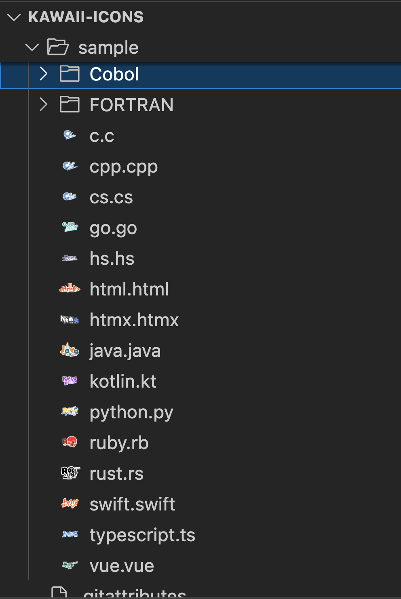

# KAWAII Icons

A cute language icon pack. These images were created by [@SAWARATSUKI](https://github.com/SAWARATSUKI) .

## Installation

- [Extensions for Visual Studio Code](https://marketplace.visualstudio.com/items?itemName=ryohidaka.kawaii-icons)

## Link

- [ServiceLogos (Original)](https://github.com/SAWARATSUKI/ServiceLogos)
